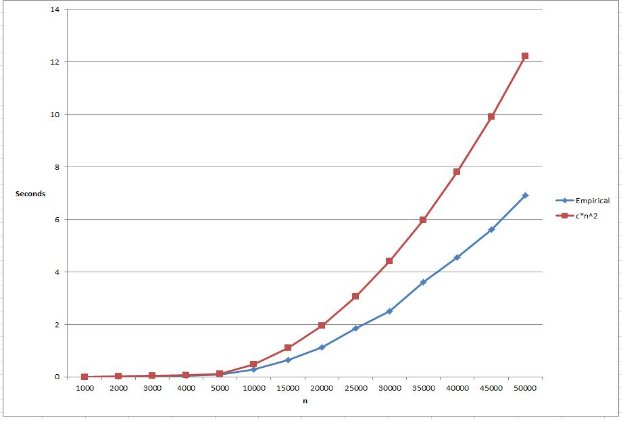

COT 6405 Project -- Rod Cutting Problem 

*Gabor Kovacs -- March, 2018* 

**Problem Definition** 

The Rod Cutting problem is an optimization problem.  The ability to solve these types of problems can be applied to various cost saving and profit optimizing problems in the real world.   

We have a rod of length n (where n >0) and we want to cut it into k pieces where k is <= n so that we can sell each piece. The pieces must be integral, meaning that if the rod is 3 units long, then it can be cut into units of size 1, 2, or 3, but not 1.5 for example.  More generally, a rod of length n can be cut into 2n-1 pieces. The value of each piece pi varies depending on its length.  We want to find a way to cut the rod so that we maximize profit. He is a simple example. 

|Length i |1 |2 |3 |4 |
| - | - | - | - | - |
|Price pi |1 |5 |8 |9 |
There are 8 ways to cut this rod: 

|Length |Revenue |
| - | - |
|4 |9 |
|1,3 |1+8=8 |
|2,2 |5+5=10 |
|3,1 |8+1=9 |
|1,1,2 |1+1+5=7 |
|1,2,1 |1+5+1=7 |
|2,1,1 |5+1+1=7 |
|1,1,1,1 |1+1+1+1=4 |
Cutting the rod into 2 pieces of size 2 yields revenue of 10, so that is the optimal way to cut. The objective is to find 2 or more different algorithms which will solve this problem and to show the differences in performance of these algorithms.  

**Algorithms and RT Analysis Algorithm 1 (Top-Down-Brute Force):**  

The recursive top-down implementation uses a brute force approach to solve the problem. It solves the same sub-problem repeatedly which makes it very slow for large n.  

*Pseudocode:* 

> CUT-ROD(p,n) 
> if n == 0 
> {
>   return 0
> }
> q = -inf
>
> for i = 1 to n 
>
> q = max(q,p[i] + CUT-ROD(p,n-i) return q 

*RT Analysis:*

1 call to CUT-ROD plus 1 to n sub calls to CUT-ROD which makes T(j) sub calls. 

`    `**T(n) = 2n** 

**Algorithm 2 (Bottom-Up-Dynamic):**  

This algorithm will use dynamic programming and will save the result of each sub problem, thereby reducing the overall RT. I’m going with the bottom-up approach for this example which should yield an RT of Θ(n2). 

*Pseudocode:* 

BOTTOM-UP-CUT-ROD(p,n) 

let r[0..n] be a new array r[0] = 0 

for j = 1 to n 

`   `q = - 

`   `for i = 1 to j 

`      `q = max(q,p[i] + r[j-i])    r[j] = q 

return r[n] 

*RT Analysis:*

We need to calculate the RT for the nested for loops. 

**Algorithm 3 (Memoized-Dynamic):**  

This algorithm will use dynamic programming and will save the result of each sub problem, thereby reducing the overall RT. I’m going with the top-down memorization approach for this example which should yield an RT of Θ(n2). 

*Pseudocode:* 

Memoized-CUT-ROD(p,n) 

Let r[0..n] be a new array 

for i = 0 to n 

`   `r[i] = - 

return Memoized-CUT-ROD-Aux(p,n,r) 

Memoized-CUT-ROD-Aux(p,n,r) 

if r[n] >= 0 

`   `return r[n] 

if n == 0 

`   `q = 0 

else  

`   `q = - 

`   `for i = 1 to n 

`      `q = max(q, p[i] + Memoized-CUT-ROD-Aux(p,n-I,r)) r[n] = q 

return q 

*RT Analysis:*

Same as the bottom up algorithm, **O(n2)**

**Experimental  Results** 

The experiment was performed using Microsoft’s Visual Studio IDE and Visual C#.NET as the programming language.  I stuck to using basic data structures (such as arrays) which can be found in other similar languages. I implemented the algorithms from what I found online, however, I had to change most of them since C# has 0 based indexes.   

I started with small values of n (n=1 to n=10) for all three algorithms for which I knew the answer (from CLRS book page 362) and verified that all 3 algorithms were producing the same results.  Then, once I was satisfied that the algorithms were correct, I wrote a function which produced sample data.  This method created an array of x size where each value was 1..30 larger than the previous value. 

I was forced to use very different values of n for the three algorithms: 

**Alg1: Top-Down-Brute-Force**   n=10; 15; 20; 25; 26; 27; 28; 29; 30; 

**Alg2: Bottom-Up-Dynamic**   

n=1000; 2000; 3000; 4000; 5000; 10000; 15000; 20000; 25000; 30000; 35000; 40000; 45000; 50000; 

**Alg3: Memoized-Dynamic**   n=1000; 2000; 3000; 4000; 5000 

The differences in n are due to the fact that algorithm 1 is very slow compared to the other two and that  algorithm 3 uses recursion, so there was a limit (between 5k and 10k) to the number of recursive calls I can make before I started receiving stack over flow errors. However, I will include a chart showing the differences as much as possible. 

For algorithm 1, Top-Down, I started with n=10 and worked my way up to 30 in increments of 5.  There was a severe decrease in performance at around n=25, so I incremented n by ones in the n=25 to n=30 range in order to show a more granular result.  After n=30, I stopped because the pattern seemed clear, the time was doubling as you increased n by 1.  

For Algorithms 2 and 3, I was able to have some ns in common, specifically n=1000 to 5000 for which I can show differences in performance below. 

Each experiment was run 5 times in a row for each of the 3 algorithms.  I then averaged the results.  At this point I noticed that for each of the 5 tests, test number 1 always ran an order of magnitude slower than tests 2-5, so I used tests 2 to 5 for the average. Below are the screenshots of the 3 experiments. I will attach the code and rename the extension from .cs to .txt so you can open it easily, but I will also paste images of the code into this report so that you can see everything color coded and properly aligned.  The experiments show the processing time, but not the actual result (max-value), since it isn’t needed for algorithm comparison. It is however calculated and a line of code can be uncommented to see it. 

*Results of algorithm 1(Top-Down-Brute Force)* 

*Results of Algorithm 2(Bottom-Up-Dynamic)* 

*Results of Algorithm 3(Memoized-Dynamic)* 

*Theoretical vs Empirical RT- Algorithm 1(Top-Down-Brute Force)* 

|**n** |**Empirical RT (sec)** |**Theoretical RT (2n)** |**c** |**c\*2n** |
| - | - | - | - | - |
|10 |0.00005 |1,024 |0.000000049 |0.00005 |
|15 |0.0013 |32,768 |0.000000040 |0.0016 |
|20 |0.04 |1,048,576 |0.000000038 |0.0512 |
|25 |1.0 |33,554,432 |0.000000030 |1.6384 |
|26 |1.9 |67,108,864 |0.000000028 |3.2768 |
|27 |3.9 |134,217,728 |0.000000029 |6.5536 |
|28 |7.7 |268,435,456 |0.000000029 |13.1072 |
|29 |15.3 |536,870,912 |0.000000028 |26.2144 |
|30 |31.1 |1,073,741,824 |0.000000029 |52.4288 |
||||Max c = 0.0000000488 ||

*Theoretical vs Empirical RT- Algorithm 2(Bottom-Up-Dynamic)* 

|**n** |**Empirical RT (sec)** |**Theoretical RT (n2)** |**c** |**c\*n2** |
| - | - | - | - | - |
|1000 |0.004 |1,000,000 |0.000000004125 |0.004887144 |
|2000 |0.02 |4,000,000 |0.000000004887 |0.019548575 |
|3000 |0.04 |9,000,000 |0.000000003917 |0.043984294 |
|4000 |0.05 |16,000,000 |0.000000003317 |0.0781943 |
|5000 |0.1 |25,000,000 |0.000000004024 |0.122178594 |
|10000 |0.3 |100,000,000 |0.000000002926 |0.488714375 |
|15000 |0.6 |225,000,000 |0.000000002858 |1.099607344 |
|20000 |1.1 |400,000,000 |0.000000002798 |1.9548575 |
|25000 |1.9 |625,000,000 |0.000000002974 |3.054464844 |
|30000 |2.5 |900,000,000|0.000000002777 |4.398429375 |
|35000 |3.6 |1,225,000,000 |0.000000002958 |5.986751094 |
|40000 |4.5 |1,600,000,000 |0.000000002839 |7.81943 |
|45000 |5.6 |2,025,000,000 |0.000000002771 |9.896466094 |
|50000 |6.9 |2,500,000,000 |0.000000002766 |12.21785938 |
||||Max c =  0.000000004887 ||

*Theoretical vs Empirical RT- Algorithm 3(Memoized-Dynamic)* 

|**n** |**Empirical RT (sec)** |**Theoretical RT (n2)** |**c** |**c\*n2** |
| - | - | - | - | - |
|1000 |0.02 |1,000,000 |0.000000022591 |0.02259135 |
|2000 |0.08 |4,000,000 |0.000000021177 |0.0903654 |
|3000 |0.1 |9,000,000 |0.000000014159 |0.20332215 |
|4000 |0.2 |16,000,000 |0.000000014002 |0.3614616 |
|5000 |0.4 |25,000,000 |0.000000014211 |0.56478375 |
||||Max c =  0.000000022591 ||

*Algorithm Comparison* 

The differences between algorithm 1(Top-Down/Brute-Force) and algorithms 2 and 3 are so drastic that charting isn’t feasible. The Top-Down approach becomes unusable after n=30/40 because of the waiting time to complete the operation whereas algorithms 2 and 3 complete in well under a second.  Algorithm 3 (Memoization) breaks between n=5000 and n=10,000 because there is a limit to how many times you can call a recursive function. We can however, compare Bottom-Up vs Memoization between n=1000 and n=5000. While the theoretical RT on both algorithms is O (n2), the theoretical data shows us that there is a clear difference in performance. By using the Bottom-Up approach, we are able to get much faster results in practice.  

**References** 

1. CLRS Book - Chapter 15 
1. http://faculty.ycp.edu/~dbabcock/PastCourses/cs360/lectures/lecture12.html 
1. http://www.radford.edu/~nokie/classes/360/dp-rod-cutting.html 
1. http://www.cs.miami.edu/home/odelia/teaching/csc317.sp15/syllabus/Algorithms7aClass\_Cont inued.pdf 
1. http://www.cs.ust.hk/mjg\_lib/Classes/COMP3711H\_Fall14/lectures/IntroDP\_Handout.pdf 
1. https://www.geeksforgeeks.org/dynamic-programming-set-13-cutting-a-rod/ 
